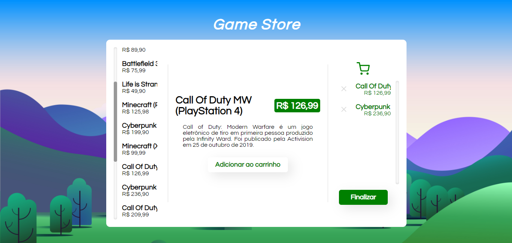

<p align="center"></p>
<p align="center"></p>

<h2 align="center">A simple game shopping application for Redux, NextJS and ReactJS code training</h2>

# ✨ [Preview](https://nextshop-mu.vercel.app/)

# ❓ About
- This web application simulates an usual online game shopping, with a list of products, the details of the selected product and an option to add and remove the product from a cart
- Is entirely made with NextJS and Redux, using the following dependencies and development dependencies:
  - [next](https://nextjs.org/)@10.0.5
  - [next-redux-wrapper](https://github.com/kirill-konshin/next-redux-wrapper)@^6.0.2
  - [react](https://pt-br.reactjs.org/)@17.0.1
  - [react-dom](https://pt-br.reactjs.org/docs/react-dom.html)@17.0.1
  - [react-icons](https://react-icons.github.io/react-icons/)@4.1.0
  - [react-redux](https://react-redux.js.org/)@^7.2.2
  - [redux](https://redux.js.org/)@^4.0.5
  - @types/node@^14.14.21
  - @types/react@^17.0.0
  - @types/react-redux@^7.1.15
  - [redux-devtools-extension](https://github.com/zalmoxisus/redux-devtools-extension)@^2.13.8
  - typescript@^4.1.3
# 👨‍💻 How to play
- Clone the repo with ``` git clone https://github.com/joaorodrs/nextshop ```
- Install the dependencies with ```yarn start``` or ```npm install```
- Start hacking on [localhost:3000](http://localhost:3000)
# 👀 To implement
- [ ] Theme switcher for the main white card
- [ ] History of cart additions and removals
- [ ] Data persist with redux
- [ ] User registration
# 💪 How you can contribute
- Leave a ⭐ on this repository
- Clone the repo and make your own version!
- Fork and make a pull request for new implementations!
